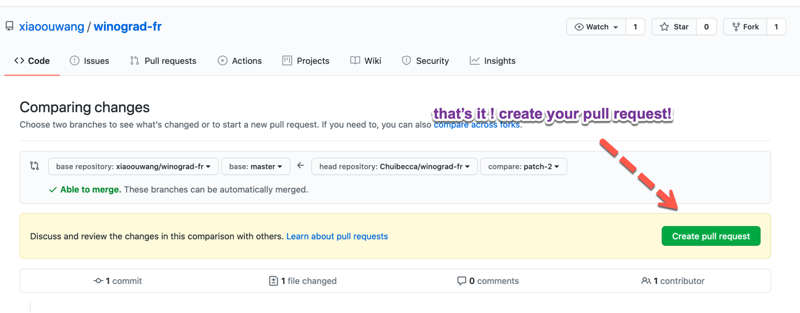
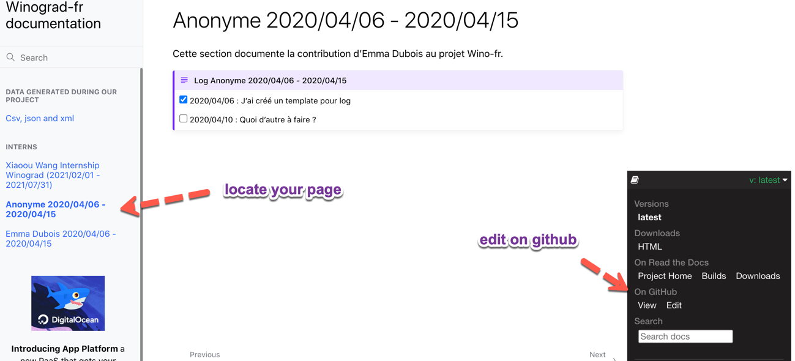

## Winograd related documentation

[Homepage](https://winograd-fr.readthedocs.io/en/latest/index.html)


## Join us

### The Git/correct way

* Fork the project.

* Create a file under `source/log` with your name, using `emma_template.rst` of Emma Dubois as a template.

* Edit the your rst file to log your work. It's quite straightforward.

* Make a commit and pull request.

**emma_template.rst**

```md
Emma Dubois 2020/04/06 - 2020/04/15
====================

Cette section documente la contribution d'Emma Dubois au projet Wino-fr.


.. |check| raw:: html

    <input checked=""  type="checkbox">

.. |uncheck| raw:: html

    <input type="checkbox">


.. admonition:: Log Emma Dubois 2020/04/06 - 2020/04/15

    |check| 2020/04/06 : Copie des nouveaux items Winograd_FR_NewItems.src dans Winograd_FR.src2

    |check| 2020/04/10 : Vérification forme et orthographe des items..

    |uncheck| 2020/04/10 : Something to do...
```

## The lazy way

Create a file named `yourname.rst` in the `source/log` folder. Use the above `index.rst` of Emma Dubois as template.

Attention, you'll need a Github account.


Use emma dubois's template.


Add some comments and propose your file change.


Create your pull request.




Next time you need to log your work, just edit your `rst` file.


Or, edit from the documentation page.

